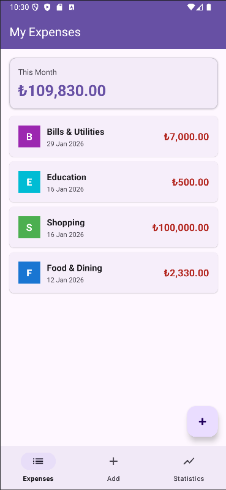
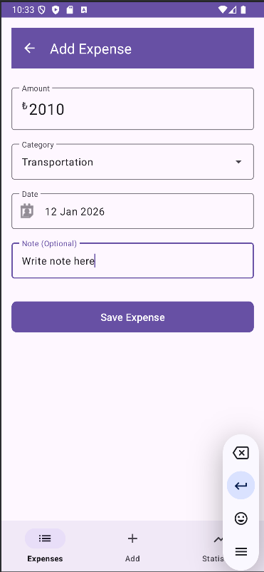
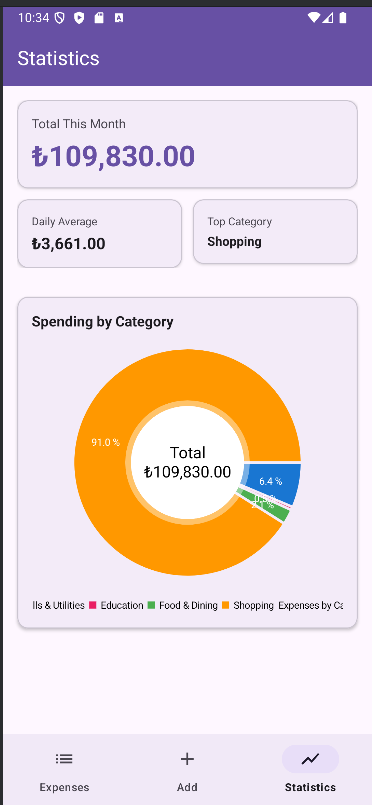

# 💰 Expense Tracker - Android App

A modern, clean architecture Android application for tracking daily expenses with statistical analysis and visualizations.


## 📱 Features

- ✅ **Add Expenses** - Record daily spending with amount, category, date, and notes
- 📊 **Statistics Dashboard** - Visual breakdown with pie charts and category analysis
- 💳 **Category Management** - Predefined categories (Food, Transport, Shopping, etc.)
- 📈 **Monthly Insights** - Track monthly totals and daily averages
- 🗑️ **Delete Expenses** - Long-press to remove unwanted entries
- 🎨 **Material Design 3** - Modern UI with smooth animations
- 🌙 **Clean Architecture** - MVVM pattern with separation of concerns

## 🏗️ Architecture

This project follows **Clean Architecture** principles with **MVVM** pattern:
```
┌─────────────────────────────────────┐
│         UI Layer                    │
│  (Fragments, Adapters, ViewBinding) │
└─────────────┬───────────────────────┘
              │
┌─────────────▼───────────────────────┐
│       ViewModel Layer               │
│  (State Management, Business Logic) │
└─────────────┬───────────────────────┘
              │
┌─────────────▼───────────────────────┐
│      Repository Layer               │
│   (Single Source of Truth)          │
└─────────────┬───────────────────────┘
              │
┌─────────────▼───────────────────────┐
│        Data Layer                   │
│  (Room Database, DAO, Entities)     │
└─────────────────────────────────────┘
```

## 🛠️ Tech Stack

### Core
- **Language:** Kotlin
- **Minimum SDK:** 26 (Android 8.0 Oreo)
- **Target SDK:** 34 (Android 14)

### Architecture & Components
- **Architecture Pattern:** MVVM (Model-View-ViewModel)
- **Dependency Injection:** Manual DI with Application class
- **Navigation:** Jetpack Navigation Component
- **UI:** XML Layouts with ViewBinding

### Libraries
| Library | Purpose |
|---------|---------|
| **Room** | Local database with SQLite |
| **Coroutines** | Asynchronous programming |
| **Flow** | Reactive data streams |
| **StateFlow** | UI state management |
| **Navigation Component** | Fragment navigation |
| **Material Design 3** | UI components |
| **MPAndroidChart** | Pie chart visualizations |
| **ViewBinding** | Type-safe view access |

### Testing
- **JUnit 4** - Unit testing framework
- **Mockito** - Mocking framework
- **Coroutines Test** - Testing coroutines
- **Architecture Components Test** - LiveData testing

## 📦 Project Structure
```
com.example.expensetracker/
├── data/
│   ├── local/
│   │   ├── dao/           # Room DAOs
│   │   ├── database/      # Database instance
│   │   └── entity/        # Room entities
│   └── repository/        # Repository implementation
├── domain/
│   └── model/            # Domain models & mappers
├── ui/
│   ├── addexpense/       # Add expense screen
│   ├── expenselist/      # List screen with RecyclerView
│   └── statistics/       # Statistics & charts
├── viewmodel/            # ViewModels & UI state
└── utils/                # Utility classes & constants
```

## 🚀 Getting Started

### Prerequisites
- Android Studio Hedgehog (2023.1.1) or later
- JDK 17
- Android SDK 34

### Installation

1. **Clone the repository**
```bash
git clone https://github.com/AErenYagli/expense-tracker-android.git
```

2. **Open in Android Studio**
    - File → Open → Select project folder

3. **Sync Gradle**
    - Let Android Studio sync dependencies

4. **Run the app**
    - Select a device/emulator
    - Click Run ▶️

## 🧪 Testing

The project includes unit tests for ViewModels:
```bash
# Run all tests
./gradlew test

# Run specific test class
./gradlew test --tests ExpenseViewModelTest
```

**Test Results:** ✅ All tests passing (BUILD SUCCESSFUL in 22s)

## 📸 Screenshots

<!-- Add your screenshots here -->
| Expense List | Add Expense | Statistics |
|--------------|-------------|------------|
|  |  |  |

## 💡 Key Highlights for Recruiters

### Clean Code Practices
- ✅ Separation of Concerns (MVVM)
- ✅ Single Responsibility Principle
- ✅ Dependency Injection
- ✅ Repository Pattern
- ✅ Kotlin Coroutines & Flow
- ✅ Comprehensive code documentation

### Modern Android Development
- ✅ Jetpack components (Navigation, Room, ViewModel)
- ✅ Material Design 3
- ✅ ViewBinding (no findViewById!)
- ✅ StateFlow for reactive UI
- ✅ Kotlin DSL for Gradle

### Production-Ready Features
- ✅ Error handling & loading states
- ✅ User input validation
- ✅ Smooth animations
- ✅ Lifecycle-aware components
- ✅ Unit tested

## 🔮 Future Enhancements

- [ ] Edit expense functionality
- [ ] Date range filtering
- [ ] Export data to CSV
- [ ] Backup & restore
- [ ] Dark mode support
- [ ] Multi-currency support
- [ ] Budget limits & alerts
- [ ] Search functionality

## 📝 License

This project is created for portfolio purposes.

## 👤 Author

**Ahmet Eren Yağlı**
- GitHub: [@AErenYagli](https://github.com/AErenYagli)
- LinkedIn: [Ahmet Eren Yağlı](https://www.linkedin.com/in/ahmet-eren-ya%C4%9Fl%C4%B1-730b751ba/)
- Email: aerenyagli@gmail.com

---

### 🌟 If you found this project helpful, please give it a star!
